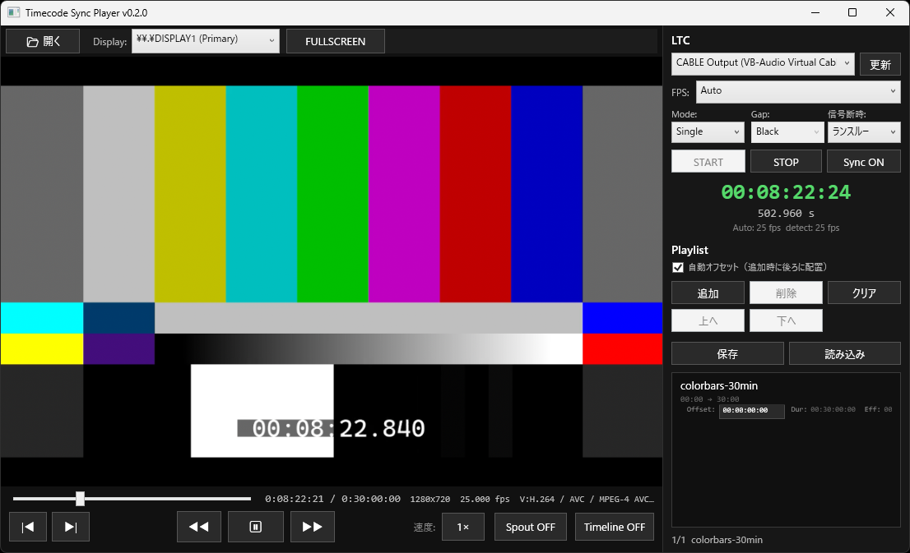

# TimecodeSyncPlayer

[English](README.en.md)

[](https://github.com/faio1230/timecode-sync-player/actions/workflows/ci.yml)
[](LICENSE)



Windows上でLTC（Linear Timecode）音声を受信し、プレイリスト内の動画を同期再生する
ライブショー向けビデオプレイヤーです。

## ダウンロード

**インストーラーとzipは[GitHub Releases](https://github.com/faio1230/timecode-sync-player/releases)からダウンロードできます。**

- 通常は、管理者権限不要の`TimecodeSyncPlayer-v0.2.0-setup.exe`を推奨します。
- 展開して使う場合は`TimecodeSyncPlayer-v0.2.0-win-x64.zip`を選択してください。
- libmpvはライセンス上の理由で同梱していません。インストール完了画面または同梱の
  `scripts/get-mpv.ps1`から取得できます。

## 主な機能

- LTC音声入力に同期したフレーム単位の動画再生
- クリップごとのタイムラインオフセットを持つSingle／Continue同期モード
- タイムコードギャップ中のBlack／Freeze表示
- LTC信号断時のランスルー／停止動作切替
- 接続ディスプレイを選択できる外部モニターフルスクリーン出力
- VJツール連携用のSpout2出力
- プレイリストとプロジェクトの保存・読み込み
- 純C# LTCデコーダとlibmpvソフトウェアレンダリング

## 動作要件

- Windows 10/11 x64
- 配布パッケージの実行には[.NET 8 Desktop Runtime](https://dotnet.microsoft.com/download/dotnet/8.0)
- x64版libmpv DLL
- LTC音声を入力できるオーディオデバイス

`SpoutDX.dll`は配布パッケージに含まれ、Spout出力を使う場合だけ利用されます。

## インストーラーの使い方

1. Releasesから`TimecodeSyncPlayer-v0.2.0-setup.exe`を実行します。ユーザー単位のため
   管理者権限は不要です。
2. 完了画面の**mpvを今ダウンロードする（get-mpv.ps1を実行）**を選択したまま完了します。
3. スタートメニューからTimecodeSyncPlayerを起動します。

アンインストールではアプリ本体、取得したlibmpv、ログ、ショートカットを削除します。
ユーザー設定`%LOCALAPPDATA%\TimecodeSyncPlayer\settings.json`は再インストール時に復元できるよう
意図的に保持されます。完全に削除する場合は手動で削除してください。

## zipの使い方

1. `TimecodeSyncPlayer-v0.2.0-win-x64.zip`を、書き込み可能なフォルダーへ展開します。
2. 展開先でPowerShellを開き、libmpvを導入します。

   ```powershell
   powershell -ExecutionPolicy Bypass -File scripts\get-mpv.ps1 -DestinationDirectory .
   ```

3. `TimecodeSyncPlayer.exe`を起動します。

手動でlibmpvを導入する場合は[ネイティブDLLガイド](native/README.md)を参照してください。

## 基本的な使い方

1. LTCを入力する録音デバイスを選択し、**START**を押します。
2. 動画を開くかプレイリストへ追加します。
3. Single／Continue、ギャップ動作、信号断時動作を選択します。
4. **Sync ON**を押してLTC同期を開始します。
5. 外部モニターへ出力する場合はDisplayを選択し、**FULLSCREEN**を押します。

## ソースからのビルド

[.NET 8 SDK](https://dotnet.microsoft.com/download/dotnet/8.0)が必要です。

```powershell
git clone https://github.com/faio1230/timecode-sync-player.git
cd timecode-sync-player
powershell -ExecutionPolicy Bypass -File scripts\get-mpv.ps1
dotnet build src\TimecodeSyncPlayer\TimecodeSyncPlayer.csproj
dotnet run --project src\TimecodeSyncPlayer\TimecodeSyncPlayer.csproj
```

ソースビルドでSpout出力を使う場合は、x64版`SpoutDX.dll`も`native`フォルダーへ配置します。
詳細は[セットアップ手順](docs/SETUP.md)を参照してください。

## ドキュメント

- [セットアップとビルド](docs/SETUP.md)
- [ネイティブDLL](native/README.md)
- [アーキテクチャ](docs/ARCHITECTURE.md)
- [設定リファレンス](docs/settings.md)
- [手動検証チェックリスト](docs/verification-checklist.md)

## 実機LTCループE2Eテスト

実機E2Eは[VB-CABLE](https://vb-audio.com/Cable/)を使い、`CABLE Input`へLTCを出力して
`CABLE Output`から取り込みます。両端点が見えるWindowsローカル音声セッションで実行してください。
ffmpegも必要です。

```powershell
dotnet test tests\TimecodeSyncPlayer.Tests\TimecodeSyncPlayer.Tests.csproj --filter "FullyQualifiedName~LtcHardwareLoop"
```

前提条件がない環境では、実機テストは自動的にスキップされます。

## ライセンス

TimecodeSyncPlayerは[MIT License](LICENSE)で提供されます。配布物に関係する第三者ライセンスは
[THIRD-PARTY-NOTICES.md](THIRD-PARTY-NOTICES.md)に記載しています。

## クレジット

Studio Sandixが開発しています。

<picture>
  <source media="(prefers-color-scheme: dark)" srcset="assets/studio-sandix-logo-white.png">
  <source media="(prefers-color-scheme: light)" srcset="assets/studio-sandix-logo.png">
  
</picture>
