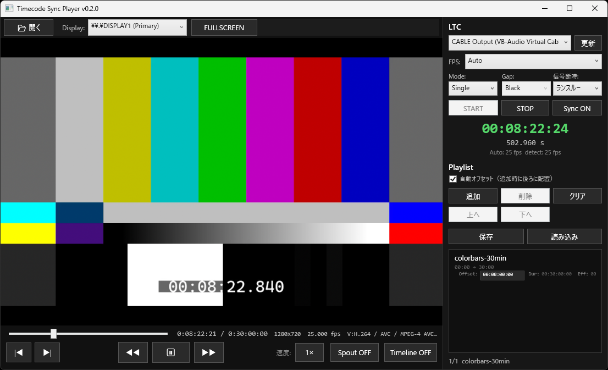

# TimecodeSyncPlayer

[English](README.en.md)

[](https://github.com/faio1230/timecode-sync-player/actions/workflows/ci.yml)
[](LICENSE)



TimecodeSyncPlayerは、LTC（Linear Timecode）の音声を受信し、プレイリストの動画をタイムコードに同期して再生する、ライブショー向けのWindows用ビデオプレイヤーです。開発コードネームはERYTHEIAです。

## ダウンロード

インストーラーとzipは[GitHub Releasesの最新の安定版（Latest）](https://github.com/faio1230/timecode-sync-player/releases/latest)からダウンロードできます。安定版はv0.6.xの最新で、v0.6.1から安定版の扱いにしています。「Pre-release」と付いた版は検証中なので、本番では使わないでください。

通常は、管理者権限が要らないインストーラー`TimecodeSyncPlayer-v<版>-setup.exe`を使ってください。展開して使う場合は`TimecodeSyncPlayer-v<版>-win-x64.zip`を選びます。`<版>`には最新の安定版の版番号が入ります（例: `v0.6.4`）。GStreamer 1.28.2のランタイムは同梱しているので、別に入れる必要はありません。

本番の前に[現場準備ガイド](docs/USER-MANUAL.md)を読んでください。素材の書き出し方しだいで、同期の安定性が大きく変わります。

## 主な機能

- LTC音声入力に同期したフレーム単位の動画再生
- クリップごとのタイムラインオフセットを持つSingle／Continue同期モード
- タイムコードギャップ中のBlack／Freeze表示
- LTC信号断時のランスルー／停止の切替
- 接続ディスプレイを選べる外部モニターのフルスクリーン出力
- VJツール連携用のSpout2出力
- プレイリストとプロジェクトの保存・読み込み
- 純C#のLTCデコーダーとGStreamerベースのGPU出力
- HAP（Hap / Hap Alpha / Hap Q）のGPUデコード（v0.5.0から）
- ProResのGPUデコード（v0.6.0から。[gst-prores-d3d11](https://github.com/faio1230/gst-prores-d3d11)による。NVIDIAのGPUで検証し、推奨します。ほかのGPUは未検証で、既定ではCPUでデコードします）

推奨する素材の形式はH.264（キーフレーム間隔は1秒を目安、長くても2秒）とProResです。HAPも警告なしで使えます。VP9・AV1・H.265なども読み込めますが推奨外で、読み込み時に警告を出します。形式ごとの推奨は[現場準備ガイド](docs/USER-MANUAL.md)を参照してください。

## 動作要件

動作には、Windows 10/11 x64、Direct3D 11.4に対応したGPUとドライバ、[.NET 8 Desktop Runtime](https://dotnet.microsoft.com/download/dotnet/8.0)、LTC音声を入力できるオーディオデバイスが必要です。検証の前提は外付け（RTX級）のGPUです。CPU内蔵のGPUでは、4K60の素材のデコードが間に合わないことがあります。

Direct3D 11.4は映像の合成と出力に使います。対応していない環境では、起動時にそのことを知らせて再生だけを無効にし、アプリは開いたままです。CPUでの合成には切り替えません。

ProResのGPUデコードのプラグインは、Microsoft Visual C++ v14再頒布可能パッケージ（x64）14.50以上（旧称 Microsoft Visual C++ 2015-2022）を必要とします。インストーラーは、入っていないか古いときだけ導入し、その途中で一度だけ管理者の確認（UAC）が出ます。zip版では、入っていないか古い場合に[vc_redist.x64.exe](https://aka.ms/vc14/vc_redist.x64.exe)を手動で実行してください。

ProResのGPUデコードはNVIDIA（RTX級）のGPUで検証し、推奨しています。プラグインはDirect3D 11の汎用のシェーダーで動くので、ほかのGPUでも画面の「ProRes の GPU 復号」をonにすればGPUでデコードできますが、未検証です。既定（auto）ではNVIDIA以外はCPUでデコードし、変更はアプリの再起動後に反映されます。

`SpoutDX.dll`は配布パッケージに含まれていますが、使うのはSpout出力のときだけです。

## インストーラーの使い方

1. Releasesから`TimecodeSyncPlayer-v<版>-setup.exe`を実行します。ユーザー単位で入るため、管理者権限は要りません。Visual C++再頒布可能パッケージが入っていないか古いPCでは、その導入のために一度だけ管理者の確認（UAC）が出ます。
2. スタートメニューからTimecodeSyncPlayerを起動します。

アンインストールでは、アプリ本体、ログ、ショートカットを削除します。ユーザー設定`%LOCALAPPDATA%\TimecodeSyncPlayer\settings.json`は、再インストール時に復元できるよう意図して残しています。完全に消す場合は手動で削除してください。

## zipの使い方

1. `TimecodeSyncPlayer-v<版>-win-x64.zip`を、書き込みできるフォルダーへ展開します。
2. Microsoft Visual C++ v14再頒布可能パッケージ（x64）14.50以上が入っていなければ、[vc_redist.x64.exe](https://aka.ms/vc14/vc_redist.x64.exe)を実行してください。
3. `TimecodeSyncPlayer.exe`を起動します。

GStreamerのランタイムは同梱しています。詳細は[セットアップ手順](docs/SETUP.md)を参照してください。

## 基本的な使い方

1. LTCを入力する録音デバイスを選び、**START**を押します。
2. 動画を開くか、プレイリストへ追加します。
3. Single／Continue、ギャップ動作、信号断時の動作を選びます。
4. **Sync ON**を押すと、LTC同期が始まります。
5. 外部モニターへ出す場合は、Displayを選んで**FULLSCREEN**を押します。

## ソースからのビルド

[.NET 8 SDK](https://dotnet.microsoft.com/download/dotnet/8.0)が必要です。

```powershell
git clone https://github.com/faio1230/timecode-sync-player.git
cd timecode-sync-player
dotnet build src\TimecodeSyncPlayer\TimecodeSyncPlayer.csproj
dotnet run --project src\TimecodeSyncPlayer\TimecodeSyncPlayer.csproj
```

ソースからのビルドには、GStreamer 1.28.2 MSVC x64のランタイムと`tcs_gstreamer.dll`も必要です（配布パッケージには同梱しています）。ProResのGPUデコードのプラグインは`scripts\get-prores-plugin.ps1`で取得します。Spout出力を使う場合は、x64版の`SpoutDX.dll`を`native`フォルダーに置きます。詳細は[セットアップ手順](docs/SETUP.md)を参照してください。

## ドキュメント

- **[現場準備ガイド](docs/USER-MANUAL.md)**: 推奨する素材の形式（キーフレーム間隔・コーデック・fps）、タイムコード信号の条件、警告の読み方
- [セットアップとビルド](docs/SETUP.md)
- [ネイティブDLL](native/README.md)
- [アーキテクチャ](docs/ARCHITECTURE.md)
- [開発ロードマップ（v0.5.x〜v0.8.0）](docs/ROADMAP.md)
- [設定リファレンス](docs/settings.md)
- [手動検証チェックリスト](docs/verification-checklist.md)

## 関連プロジェクト

[gst-prores-d3d11](https://github.com/faio1230/gst-prores-d3d11)は、ProResをDirect3D 11でGPUデコードするGStreamerプラグインで、同じ開発者が開発しています。ライセンスはLGPL-2.1以降です。TimecodeSyncPlayerの配布物に同梱しています。

## 実機LTCループE2Eテスト

実機のE2Eテストは[VB-CABLE](https://vb-audio.com/Cable/)を使い、`CABLE Input`へLTCを出力して`CABLE Output`から取り込みます。両方の端点が見えるWindowsのローカル音声セッションで実行してください。ffmpegも必要です。

```powershell
dotnet test tests\TimecodeSyncPlayer.Tests\TimecodeSyncPlayer.Tests.csproj --filter "FullyQualifiedName~LtcHardwareLoop"
```

前提がそろっていない環境では、実機テストは自動的にスキップされます。

## ライセンス

TimecodeSyncPlayerのライセンスは[MIT License](LICENSE)です。配布物に関係する第三者のライセンス（同梱するGStreamerランタイムとgst-prores-d3d11を含む）は[THIRD-PARTY-NOTICES.md](THIRD-PARTY-NOTICES.md)に記載しています。

## クレジット

Studio Sandixが開発しています。

<picture>
  <source media="(prefers-color-scheme: dark)" srcset="assets/studio-sandix-logo-white.png">
  <source media="(prefers-color-scheme: light)" srcset="assets/studio-sandix-logo.png">
  
</picture>
