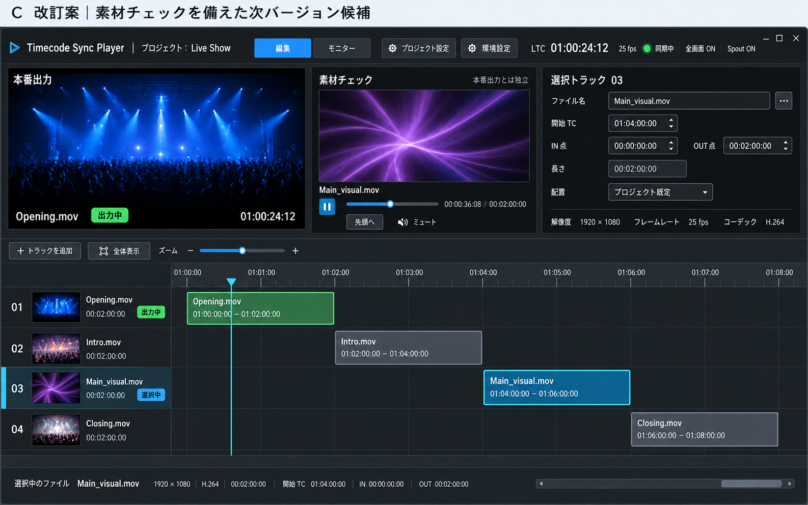

# UI 刷新のロードマップ（仕込み環境の刷新・トランジション）

更新日: 2026-09-27（`docs/ROADMAP.md` 2026-09-22 版の UI 関連の節を、UI/UX の作業ブランチへ切り出したもの）

本書は、UI リデザインの検討セッションで合意した方向性と、実装前に詰める事項をまとめたロードマップ案です。
記載する機能は実装済みではありません。リリース日・工数・対応ハードウェアの範囲は未定です。
製品全体の版の並び（v0.5.x 安定版 → v0.6.0 ProRes → v0.7.0 UI 刷新 → v0.8.0 トランジション）は `docs/ROADMAP.md` を正とします。
UI/UX の作業は本ブランチ系（`ui-ux-docs`、実装は `codex/ui-ux-demo`）で進め、main には版の公開時に統合します。

画面の構成と遷移の設計案は [UI・画面遷移の設計案](UI-UX-DESIGN.md)。

## 1. 仕込み環境の刷新（旧 v0.6.0 案 → v0.7.0 の主題）

### 1.1 UIの基本構成

採用方向は、**1ファイル＝1トラックを維持したC案**です。
完成した素材を読み込み、内容を確認し、タイムラインに配置する作業を中心に設計します。

編集・モニター・設定画面の構成と遷移は、[UI・画面遷移の設計案](UI-UX-DESIGN.md)で具体化します。

画像はimagegenの組み込みツールで作成した検討用モックです。数値・文言・寸法は仕様ではありません。
ドラッグ操作用のハンドルやフェード設定は、この画像を作成した後に追加した候補です。

| 領域 | 内容 |
|---|---|
| 上段左：本番出力 | 実際に出力中の映像・ファイル名・再生状態 |
| 上段中央：素材チェック | 選択した別素材の試写、再生・一時停止・シーク、素材内の位置表示 |
| 上段右：選択トラックの設定 | 開始TC、IN／OUT、配置、素材情報、フェード設定 |
| 下段：タイムライン | ファイルごとの独立した行、共通の時間軸、選択対象と出力対象の識別 |
| 常設の状態表示 | LTC受信・同期・全画面・Spoutの状態と異常 |

- 編集ビュー／モニタービューを切り替えられるようにします。切り替えるのは表示内容であり、再生・同期・出力の状態ではありません。
- 本番出力中も編集ビューを開けるようにします。
- 環境設定は別ウィンドウへ分離します。プロジェクトごとの設定は仕込み画面から開きやすくし、保存対象を区別します。
- ファイル差し替えは補助操作として、ファイル名横の「…」メニューなどに収めます。常設の大きな差し替えパネルは設けません。
- モニターの別ウィンドウ化は拡張候補とし、v0.7.0（UI 刷新）の必須範囲にするかは未確定です。

### 1.2 本番と独立した素材チェック

- 本番とは別の再生セッションで、同時に1素材を確認します。
- 基本操作は素材の読み込み、再生・一時停止、先頭への移動、シークです。
- 初期案ではシークバーを離した位置へ移動します。ドラッグ中に映像が追従するスクラブは後続の拡張候補です。
- 素材内の時刻と本番LTCを区別して表示します。素材チェックの操作で本番の再生位置を変更しません。
- 音声は初期ミュートとします。専用の音声出力先や詳細な試聴機能は別途検討します。
- 正確な逆方向コマ送り、アプリ内での高度な素材編集は初期範囲に含めません。

現在の本番出力を縮小表示するプレビューとは別の映像経路が必要です。
再生APIは再利用を検討できますが、複数プレイヤーの同時動作と負荷は先行検証します。

### 1.3 タイムラインの直接操作

ドラッグ移動、端をつかむトリミング、取り消し／やり直し、スナップ、数値入力による微調整を候補に含めます。
具体的な操作仕様の初期案は次のとおりです。

| 操作 | 変更する内容 | 維持する内容 |
|---|---|---|
| クリップ本体を左右にドラッグ | 開始TC | 素材IN／OUTと長さ |
| 左端をドラッグ | 開始TCと素材IN | タイムライン上の終了位置 |
| 右端をドラッグ | 素材OUTと終了位置 | 開始TCと素材IN |
| 上隅のフェードハンドルをドラッグ | フェード時間 | クリップの配置と使用範囲 |

- トリミングは元ファイルを変更せず、プロジェクト上の使用範囲を編集します。
- 他のクリップは自動でずらさないことを基本とします。
- 選択・移動・トリミング操作と、本番のシーク操作を分けます。
- ドラッグ中の仮の値をそのまま本番へ反映しない設計とします。
- 出力中の曲や直近の曲に対する変更の反映時点は、実装前に決めます。単にマウスを離せば常に即時反映してよいとはしません。
- クリップの重なり、素材範囲の上下限、スナップ対象、異なるfps間のフレーム丸めを定義します。

### 1.4 基本のフェードIN／OUT

v0.7.0（UI 刷新）では、単一クリップの黒からのフェードINと黒へのフェードOUTを基本範囲とします。

- GPU合成のシェーダー経路へ、フェード進行度を渡す設計を検討します。
- 進行度はタイムライン位置から求めます。LTCが途中へジャンプした場合にも、その位置の明るさを再現します。
- フェード時間はハンドルと設定欄の両方で調整し、クリップ内に傾斜線を表示します。
- 素材チェック側でも、設定した効果を確認できるようにします。
- 映像フェードを対象とします。音声フェード、透過アルファの出力、複雑なカーブ編集は別途検討します。
- フェード時間がクリップ長を超える場合や、IN／OUTのフェードが重なる場合の規則は未確定です。

### 1.5 内部の進め方と完了条件

実装は、UIと出力制御の分離 → 独立した素材チェック → タイムライン編集 → 単体フェードの順に段階を設けます。

完了条件の案:

- ビュー切り替えや設定ウィンドウの開閉で、再生セッション・全画面出力先を作り直さない。
- 本番出力中に素材読み込み・シーク・編集を行っても、出力やLTC同期を乱さない。
- 素材チェックの読み込み失敗や終了が、本番側の停止・素材変更を起こさない。
- 素材チェックを併用しながら、LTCのジャンプ・信号断・曲境界通過を確認する。
- 配置・IN／OUT・フェード設定の保存と再読み込み、および編集の取り消しが整合する。
- 全画面とSpoutを実機で確認し、対象素材・解像度・GPUと計測結果を記録する。

UIスレッドからの独立はGPU描画だけでなく、同期判断・再生制御・出力状態更新についても検討します。
試写の表示解像度を下げることだけで、デコード負荷が十分に減るとは見なしません。

## 2. HLSLによるカスタムトランジション（旧 v0.7.0 案 → v0.8.0 の主題）

### 2.1 目的と範囲

ユーザーがHLSLでトランジションを記述し、アプリへ読み込める仕組みを目指します。
クロスフェードやワイプは、この共通の仕組みで動作する標準サンプルとして提供する案です。

土台として、切り替え元と切り替え先の2映像の同時再生・先読み・GPU合成を整備します。
現在の単一アクティブクリップの選択規則を拡張し、トランジション対象の2クリップと区間を明示的に扱います。
独立した素材チェックの併用時には、最大3本の同時デコードを想定して検証します。

### 2.2 アプリとHLSLの役割

| 担当 | 役割 |
|---|---|
| アプリ | 素材読み込み、先読み、再生位置、LTC同期、トランジション区間・進行度の計算、出力の継続 |
| HLSL | 渡された2枚の映像と進行度を使い、その時点の合成結果を生成 |

HLSLへ渡す情報の案:

- 切り替え元・切り替え先の映像テクスチャ。
- タイムライン位置から求めた進行度 `0〜1`。
- 出力サイズ。
- ユーザーが設定するパラメーター（方向、境界のぼかし幅など）。

エントリーポイント、リソース配置、パラメーターの宣言・保存形式、色・アルファの扱いは別途仕様化します。
途中へのシークやLTCジャンプでも同じ位置の見た目を再現することを基本とします。

### 2.3 作成・確認・適用の流れ

1. 外部エディターでHLSLを作成する。
2. アプリに読み込み、コンパイル結果を確認する。
3. 素材チェック側で、2素材を使った効果とパラメーターを確認する。
4. 明示的に適用し、プロジェクトへ設定を保存する。

右の設定パネルに「種類・長さ・パラメーター」を置く案です。
コンパイル失敗時は編集側にエラーを表示し、本番は適用済みのシェーダーを維持します。
コンパイル成功だけで本番使用可能とせず、描画結果と実行負荷の検証方法を定めます。
アプリ内コードエディターは後続の拡張候補です。

### 2.4 完了条件の案

- 標準サンプルと外部HLSLを同じ仕組みで読み込み・確認・適用できる。
- トランジション中のLTCジャンプ・シークでも、両素材の位置と進行度が整合する。
- 次素材が準備できない場合、読み込みに失敗した場合、素材が不足する場合の動作を定義し、検証する。
- コンパイル失敗や編集中のシェーダー変更が、そのまま本番へ反映されない。
- 素材チェック併用時も、全画面・Spout出力と同期の条件を満たす。
- シェーダーの参照・パラメーターを保存・再読み込みでき、別PCへのプロジェクト移動時の扱いを定める。

## 3. モックの生成記録

組み込みimagegenツールでC案を編集し、選択された改訂案を本書とともに保存しました。
生成指定の要旨は「上段に本番出力・独立した再生／シーク付き素材チェック・選択トラック設定、下段に1ファイル1行のタイムラインを維持し、差し替えの常設パネルを除いてファイル名横のメニューに収める」です。

関連資料: [内部構造](ARCHITECTURE.md)、[実機検証チェックリスト](verification-checklist.md)。

