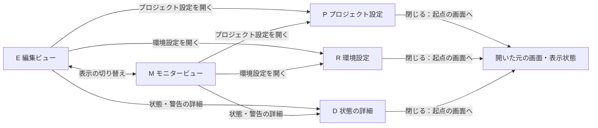

# v0.6.0 UI・画面遷移の設計案

更新日: 2026-09-23

本書は[ロードマップ](ROADMAP.md)を画面・操作・遷移へ具体化するための検討資料です。
C改訂案を出発点に、Pencilで作る画面と状態の範囲を整理しています。
詳細な配置、モニター画面、設定項目の分類、編集内容の反映規則は提案段階です。
`.pen`データや動作プロトタイプはまだ作成していません。

## 1. 画面と本番状態を別々に扱う

画面の選択は「編集ビュー／モニタービュー」、出力・同期・再生の状態は別の情報として管理します。
モニタービューを開く操作は本番開始を意味せず、編集ビューへ戻る操作は本番停止を意味しません。

| 組み合わせ | 用途 |
|---|---|
| 編集ビュー・出力停止中 | 素材チェック、配置、トリミングなどの仕込み |
| 編集ビュー・出力中 | 本番を監視しながら、必要な素材や配置を編集 |
| モニタービュー・出力停止中 | 開演前の状態確認、待機 |
| モニタービュー・出力中 | 映像・LTC・同期・次の曲・異常の監視 |

この表の「出力中」は概要表現です。実際の画面では全画面とSpoutの状態を個別に表示します。
LTC受信、同期設定、映像の再生・停止・保持も、それぞれ独立した状態として扱います。
静止画が出ていることだけで異常と判断せず、停止・Freeze・信号断などの理由を区別します。

## 2. 画面一覧と構成案

| ID | 画面 | 構成・役割 |
|---|---|---|
| E | 編集ビュー | C案。上段に本番出力・素材チェック・選択トラック設定、下段に1ファイル1行のタイムライン |
| M | モニタービュー | 大きな本番映像とLTC、現在／次の曲、同期・出力状態、理由付きの警告。編集へ戻る入口を常設 |
| P | プロジェクト設定 | キャンバス、配置の既定値、同期・信号断・Gapの動作など、プロジェクト単位の候補項目 |
| R | 環境設定 | 表示・操作、機器の選択など、アプリ／PC単位の候補項目 |
| D | 状態の詳細 | 警告や出力状態から開く詳細パネル。原因、対象、可能な対処を示す |

PとRは独立した設定ウィンドウとして検討します。タブの開閉・移動だけでは設定を適用しません。
どの設定をプロジェクトに保存し、どれをPC側に保存するかは実装前に確定します。
ファイルを開く／保存する操作は共通ヘッダーから利用できる案とし、別のホーム画面は初期案では追加しません。

### 編集ビュー E

- [C改訂案](images/roadmap-v06-c-concept.png)の領域構成を維持します。
- 素材チェックには再生・一時停止・先頭へ・シーク・音声状態を表示します。
- 出力中のトラック、編集の選択対象、素材チェックに読み込まれた素材を区別します。
- 右パネルに配置・IN／OUT・フェードをまとめ、差し替えはファイル名横のメニューに収めます。
- 本体・端・上隅の操作領域を描き分け、移動・トリミング・フェード調整を取り違えにくくします。

### モニタービュー M

初期レイアウト候補:

- 上部: 共通ナビゲーションと、LTC受信・同期・全画面・Spoutの状態。
- 主領域: 本番映像を大きく表示。
- 隣接領域: 大きなLTC、現在の曲、次の曲と開始TC。
- 下部: 読み取り専用の進行表示と、状態に応じた警告・理由。
- 編集ビューへ戻る操作は常に見える位置に置く。

モニターのタイムラインは、初期案ではクリックしても本番シークしない表示専用とします。
本番の再生・停止・シーク・同期ON／OFF・出力ON／OFFをどこまで常設するかは要検討です。
必要な操作は明示的なコントロールとして設け、画面移動に伴って自動実行しません。

## 3. 画面遷移図



この図の矢印は画面操作だけを表します。本番の再生・同期・出力の開始／停止は含みません。
設定や詳細を閉じたときは、開いた元のビュー・選択・スクロール位置へ戻します。

### 遷移と操作の契約案

| 操作 | 画面側で変わること | 本番側への影響 |
|---|---|---|
| 編集 ↔ モニター | 表示内容 | 出力・同期・再生位置を維持 |
| 設定を開く／タブ切り替え／閉じる | 設定画面の表示 | 開閉だけでは設定や出力を変更しない |
| トラックを選択 | 選択表示・右の設定内容 | 出力対象や本番の再生位置を変更しない |
| 素材を試写・シーク | 素材チェックの映像・位置 | 本番の再生セッションを操作しない |
| 移動・トリミング中 | 仮の輪郭・値・補助線 | 途中の値を本番へ送らない |
| 編集を確定 | プロジェクトの編集結果 | 対象と反映時点の規則を別途定義 |
| 設定の適用 | 適用後の値・状態を表示 | 明示された対象だけに適用。出力再構成が必要な変更は事前に分かる表示にする |
| 警告を開く／閉じる | 詳細の表示 | 開閉だけでは再試行・停止などを実行しない |

ビューの切り替え時には、編集の選択、ズーム、スクロール、素材チェックの読込済み素材と位置を保持する案です。
非表示になった素材チェックを再生継続するか一時停止するかは未確定です。本番とは独立して規則を決めます。
ドラッグ途中でビューを切り替えた場合に仮操作を取り消すか、切り替えを待つかも未確定とします。

## 4. Pencilで作る画面と状態

Pencil上では画面一覧、画面モック、操作状態、遷移の注釈を分けて配置します。
画面上の矢印・注釈は設計上の説明です。実際にクリックして動くプロトタイプの範囲は、利用できるツールと別途確認します。

| グループ | 作成する内容 |
|---|---|
| 00 Flow | 画面一覧、遷移図、表示切り替えと本番操作の区別 |
| 01 Components | 色・文字・余白、ボタン、TC入力、状態表示、トラック行、移動／トリム／フェードのハンドル |
| 02 Edit | 未読込、通常、選択、素材チェック再生中、移動中、左右トリム中、フェード調整中、本番出力中の編集 |
| 03 Monitor | 待機、本番出力中、意図した停止・保持、LTC信号断、出力異常 |
| 04 Settings | プロジェクト設定、環境設定、未適用の変更、適用失敗の表示 |
| 05 Flows | 仕込み開始、本番監視への切り替え、本番中の編集と復帰、異常の確認 |

画面IDと状態名を付け、文書とPencilのフレーム名を対応させます。
例: `E-Selected`、`E-Dragging`、`E-TrimmingLeft`、`M-OutputActive`、`M-SignalLost`。
画像生成で作ったC案のピクセル値をそのまま仕様にせず、Pencilで寸法・文字・余白を定義し直します。
標準サイズと小さいウィンドウの2条件を用意し、縮小時のパネル幅・スクロール・折り畳みを検討します。

## 5. 確認する操作シナリオ

1. **通常の仕込み**: 編集ビューで素材追加 → 選択 → 素材チェック → 配置・トリム・フェード調整 → 保存。
2. **本番前の確認**: プロジェクト／環境設定を確認 → 明示的に同期・出力を操作 → モニタービューへ移動。
3. **本番中の編集**: モニターで出力を確認 → 編集ビューへ移動 → 今後の素材を確認・編集 → 定めた規則で反映 → モニターへ戻る。
4. **異常の確認**: 信号断や出力異常を常設表示 → 詳細を開く → 必要な対処を明示的に実行 → 元の画面へ戻る。
5. **編集の取り消し**: 移動・トリムの開始 → 仮表示を確認 → 取消 → 元の配置・値に戻る。本番側へ仮の値は反映しない。

## 6. 次に決めること

- モニタービューで常設する本番操作と、その配置。
- 本番中の編集内容を確定・反映する方法。出力中／次に再生する／それ以降の曲での扱い。
- 設定項目の分類、未適用の変更がある設定画面を閉じる際の動作。
- 素材チェックの読込方法と、ビュー切り替え時の再生・音声の扱い。
- ドラッグ中のビュー切り替え、キーボードフォーカス、ショートカットの適用先。
- 多数トラック、縦長動画、小さい画面、Windowsの表示倍率への対応。

これらは画面を比較しながら詰める事項です。現時点でPencil案や動作仕様を確定扱いにしません。

## 7. iPhoneからのレビュー手順

PC側でPencilの編集可能なデータを管理し、iPhone側はこのチャットで指示・画像確認する流れを目指します。
画面ごとの画像と、操作前後を対応させた遷移図を書き出します。
修正時は画面IDを使い、デザインデータと本書の動作仕様を合わせて更新します。

準備状況（2026-09-23）:

- PCへ公式CLI `@pen.dev/cli` 0.3.8を導入済み。
- このPCのNode.js 25ではCLI終了時にエラーが発生したため、Node.js 22経由でバージョン表示と認証状態の確認まで実施。
- Pencilアカウントは未認証。編集・画像出力の実動作はログイン後に検証する。
- `.pen`ファイルは未作成。初回に小さな図形の保存・画像出力を確認してから、画面設計へ進む。

初回ログインは、PCのPowerShellで本人が次を実行します。
認証情報はチャットやリポジトリに記録しません。

```powershell
npm exec --yes --package=node@22 -- pen login
```

以後の編集にはCLIの対話ツール操作を使い、画像をチャットへ提示する方式を検証します。
画面遷移図の閲覧と、実際にタップして動くプロトタイプは区別します。
外部共有リンクの作成はこの手順に含めず、必要になった場合に扱います。

参照: [公式CLI](https://docs.pencil.dev/for-developers/pen-cli)。
